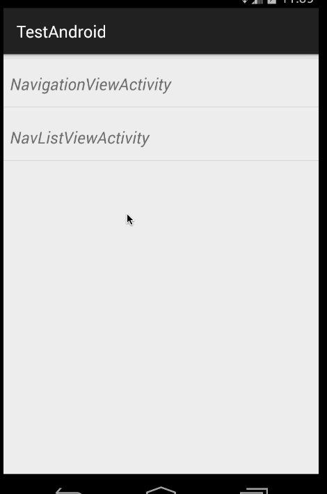

# Android_Blog_Demos

source code in blog ~

### 导入方式

下载到本地以后，直接在Android Studio中选择import module，选择blogcodes（注意选择这个文件夹）即可。

###[2015-06-07更新]

以后所有的blog代码将以列表的形式添加到blogcodes这个module中。

如下：

哈，列表Item会不断增加的。

大家只要安装这一个，就可以查看所有博客上的源码示例，以前的几个modules保持不变。
